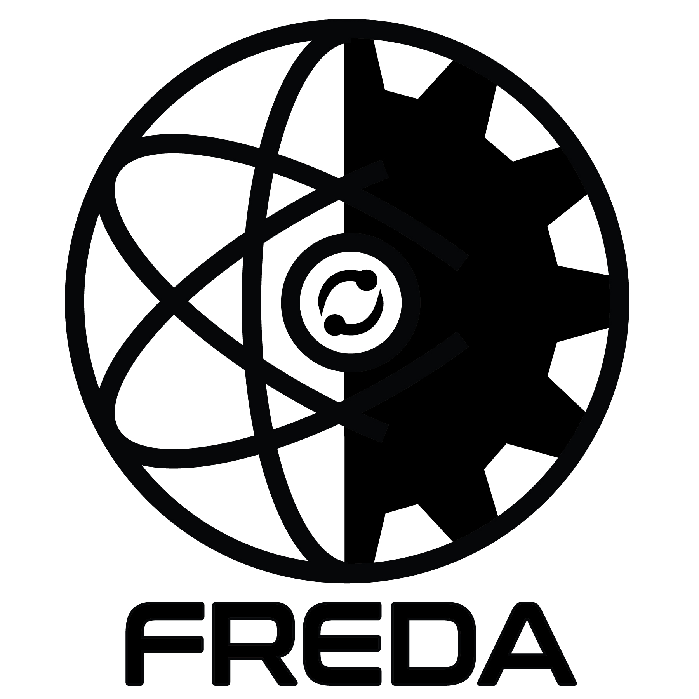

Introduction
============

The Fusion REactor Design and Assessment (FREDA) Project
----------------------------
FREDA is a purpose-built framework for self-consistent, multi-fidelity, iterative optimization of next step fusion devices.
FREDA connects the fusion-plasma modeling to surrounding fusion-engineering components, incorporating the theory-based integrated plasma modeling suite **IPS-FASTRAN/CESOL** and the multiphysics simulation tools of Fusion Energy Reactor Models Integrator (**FERMI**). FREDA utilizes parametric geometry to enable automatic generation of detailed parametrized CAD.   
